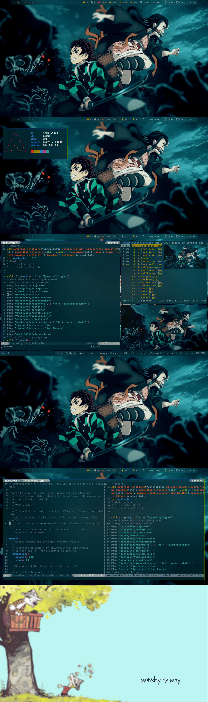

# dotfiles_bspwm
```
dotfiles/
├── bashrc
├── config
│   ├── alacritty
│   ├── .aliasrc
│   ├── bspwm
│   ├── dmenu
│   ├── dunst
│   ├── git
│   ├── gtk-3.0
│   ├── htop
│   ├── Kvantum
│   ├── mpv
│   ├── mutt
│   ├── newsboat
│   ├── nvim
│   ├── picom
│   ├── polybar
│   ├── qt5ct
│   ├── ranger
│   ├── scripts
│   ├── simplenote
│   ├── slock
│   ├── sxhkd
│   ├── sxiv
│   ├── X11
│   ├── yay
│   ├── zathura
│   └── .zplug
├── gtkrc-2.0
├── icons
│   └── Breeze-Blue
├── local
│   └── share
├── xinitrc
└── zshrc
```

## Requirements
* working arch linux with bspwm
* ```pacman -S --needed python python-pip zsh```
* [yay](https://github.com/Jguer/yay)
* change shell to zsh
  * ```chsh -s $(which zsh)```
* place [wallpapers](https://github.com/ask1234560/wallpapers) in ```~/Pictures``` for selecting wallpapers using sxiv and during startup

## Installation
```
* cd ~/.config
* git clone https://github.com/ask1234560/dotfiles_bspwm
* cd dotfiles_bspwm
* git submodule init
* git submodule update --recursive
* update submodules(dotdrop, dmenu, nvim)
   * git submodule foreach git pull origin master
* create and activate environment
   * python3 -m venv environment
   * source environment/bin/activate
   * pip3 install -r requirements.txt
* config.yaml is for user specific configs and global-config.yaml for system wide configs. Edit the yaml files with the hostname and the required configs
* ./dotdrop.sh install
* install zplug
  * curl -sL --proto-redir -all,https https://raw.githubusercontent.com/zplug/installer/master/installer.zsh | zsh
* cp -r dotfiles/config/{nvim,dmenu} ~/.config
* build dmenu
   * cd ~/.config/dmenu
   * sudo make install
* set qt theme to Adapta Nokto(kvantum, qt5ct).
* (optional) to remove backup files
   * find ~ -regextype grep -regex '.*/*dotdropbak' -exec rm {} \;
* for changing theme, change in alacritty, nvim, nvim quick scope pluggin(init.vim), ~/.Xresources, dmenu, dunst, polybar(reads Xresources), cursor, mpv. Scrot custom region screenshot and bspwm focused window border have same width and color.
* Terminal font nerd-fonts-source-code-pro, nerd-fonts-fira-code for remaining apps.
```

## (Optional) Explicitly installed packages
```
abook adapta-gtk-theme alacritty alsa-firmware alsa-utils aspell aspell-en autoconf automake autopep8 base binutils bison brave-bin broadcom-wl-dkms bspwm cpupower-gui cronie dosfstools dunst efibootmgr exa exiv2 fakeroot ffmpegthumbnailer file findutils flex gawk gcc gettext gimp git gnome-calculator-gtk3 grep groff grub gtk-engine-murrine gzip hsetroot htop-vim-git imagemagick inetutils kvantum libreoffice-fresh libtool linux-firmware linux-zen linux-zen-headers lsof lynx m4 make man-db megasync-bin mpv mutt-wizard-git neovim nerd-fonts-fira-code nerd-fonts-source-code-pro networkmanager newsboat noto-fonts npm ntfs-3g numlockx openresolv p7zip pacman pacman-contrib papirus-icon-theme patch pfetch-git picom-git pkgconf polybar pulseaudio pulseaudio-alsa python-pip python-pynvim python38 qt5ct ranger redshift-minimal rmtrash scrot sed simple-mtpfs subliminal-git sudo sxhkd sxiv syncthing telegram-desktop texinfo thunar timeshift tor-browser transmission-cli trash-cli ttf-material-design-icons-git ttf-ms-fonts ttf-roboto ttf-symbola ttf-vista-fonts ueberzug unclutter unrar unzip virtualbox virtualbox-ext-oracle virtualbox-guest-iso weechat wget which xclip xdg-user-dirs xdotool xf86-video-intel xorg-server xorg-xdpyinfo xorg-xev xorg-xinit xorg-xrandr xorg-xsetroot yay-bin youtube-dl zathura zathura-pdf-poppler zip zsh
```

## Screenshots

