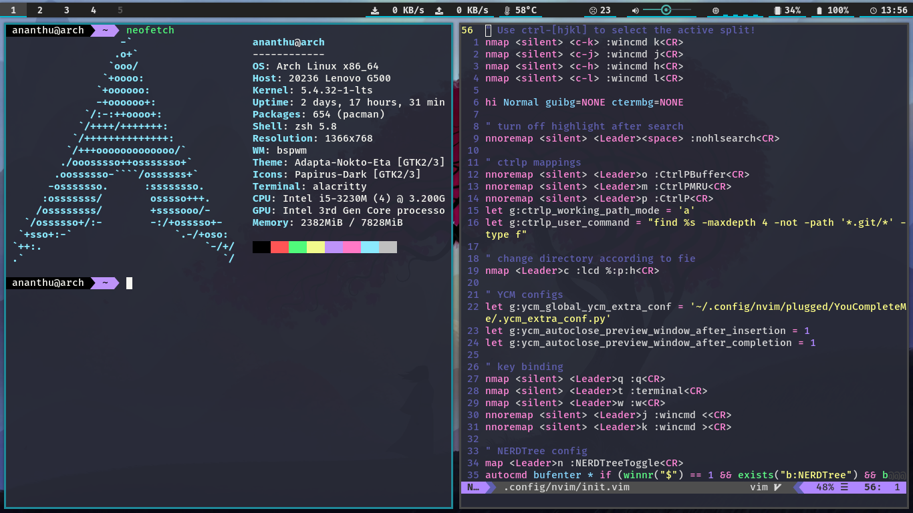

# dotfiles_bspwm
```
dotfiles_bspwm/dotfiles
├── bashrc
├── config
│  ├── alacritty
│  ├── bspwm
│  ├── dunst
│  ├── htop
│  ├── mpv
│  ├── newsboat
│  ├── nvim
│  ├── polybar
│  ├── ranger
│  ├── scripts
│  ├── sxhkd
│  └── sxiv
├── etc
│  ├── openvpn
│  └── pacman.conf
├── gitconfig
├── icons
│  └── Breeze-Red
├── irssi
│  └── config
├── local
│  └── share
├── xinitrc
├── Xmodmap
├── xprofile
├── Xresources
└── zshrc
```

## Screenshots




## Requirements
* working arch linux with bspwm
* firacode nerd font
* pipenv
* zsh
* change shell to zsh
  * chsh -s $(which zsh)

## Installation 
* cd ~/.config
* git clone https://github.com/ask1234560/dotfiles_bspwm
* cd dotfiles_bspwm
* pipenv --three
* git submodule init 
* git submodule update --recursive 
* update submodules(dotdrop, nvim, ranger_devicons)
   * git submodule foreach git pull origin master
* pipenv install -r dotdrop/requirements.txt
* pipenv shell
* cp config.yaml config.yaml.bak
* substitute hostname
   * awk '{gsub(/arch/,"hostname")} {print $0}' config.yaml.bak | tee config.yaml
* ./dotdrop.sh install
* (optional) to remove backup files
   * find ~ -regextype grep -regex '.*/*dotdropbak' -exec rm {} \\;
   
   
## (Optional) Explicitly installed packages  
```
yay -S adapta-gtk-theme alacritty alsa-firmware alsa-utils autoconf automake base bc betterlockscreen binutils bison broadcom-wl-dkms bspwm chromium cronie dmenu dosfstools dunst efibootmgr evince exa exiv2 fakeroot file findutils flex gawk gcc gettext gimp git grep groff grub gtk-engine-murrine gzip hsetroot htop imagemagick libreoffice-fresh libtool linux-firmware linux-lts linux-lts-headers lynx m4 make man-db mlocate mpv neofetch neovim networkmanager newsboat noto-fonts npm numlockx openresolv openvpn pacman pacman-contrib papirus-icon-theme patch pavucontrol picom pkgconf polybar pulseaudio pulseaudio-alsa python-pip ranger redshift-minimal rmtrash scrot sed simplenote-electron-bin sudo sxhkd sxiv syncthing texinfo thunar timeshift trash-cli ttf-indic-otf ttf-ms-fonts ttf-roboto ttf-vista-fonts vi which xclip xdg-user-dirs xdman xorg-server xorg-xev xorg-xinit xorg-xsetroot yay zsh
```
