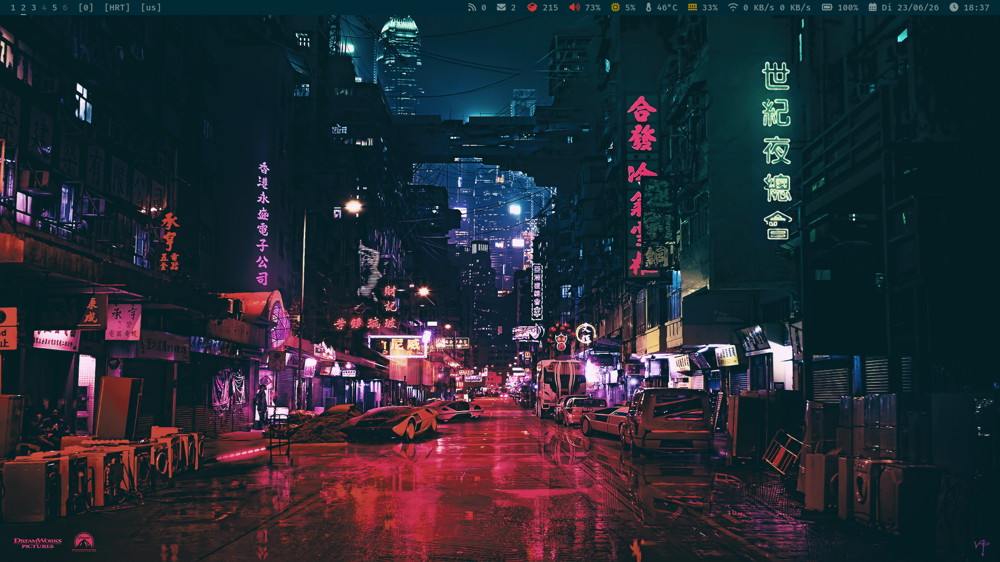
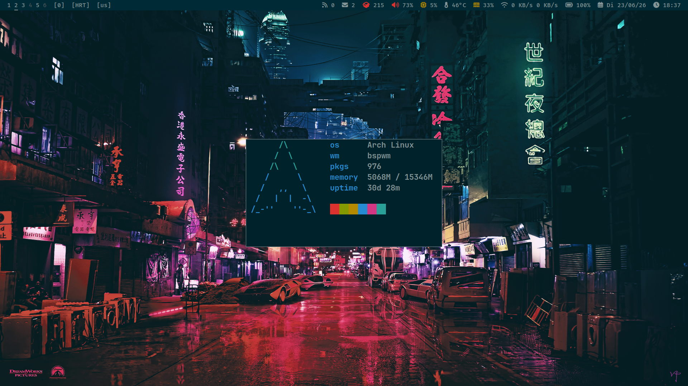
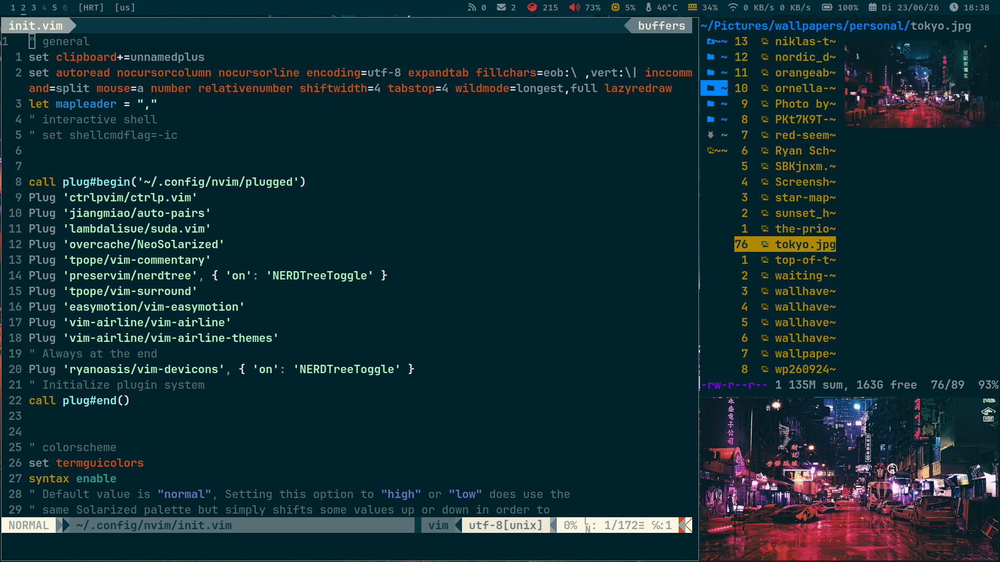

# dotfiles_bspwm

## Screenshots





## General
This branch mainly focuses on performance. For transparency use [picom](https://github.com/ask1234560/dotfiles_bspwm/tree/master/dotfiles/config/picom) from master branch.

## Available dotfiles
```
dotfiles/
├── bashrc
├── config
│   ├── alacritty
│   ├── alias_and_keybinds
│   ├── browser_extensions_backup
│   ├── bspwm
│   ├── cpupower_gui
│   ├── dmenu
│   ├── dunst
│   ├── eza
│   ├── gdb
│   ├── git
│   ├── gtk-2.0
│   ├── gtk-3.0
│   ├── gtk-4.0
│   ├── htop
│   ├── Kvantum
│   ├── mimeapps.list
│   ├── mpv
│   ├── mutt
│   ├── newsboat
│   ├── nvim
│   ├── paru
│   ├── picom
│   ├── polybar
│   ├── qt5ct
│   ├── ranger
│   ├── scripts
│   ├── slock
│   ├── starship.toml
│   ├── sxhkd
│   ├── sxiv
│   ├── tmux
│   ├── X11
│   ├── yay
│   └── zathura
├── Desktop
│   └── xtra
├── local
│   └── share
└── zshrc
```

## Requirements
* [dotdrop](https://aur.archlinux.org/packages/dotdrop-git)
* place [wallpapers](https://github.com/ask1234560/wallpapers) in ```~/Pictures``` for selecting wallpapers using sxiv and during startup

## Installation
```
* git clone --recurse-submodules --single-branch --branch performance https://github.com/ask1234560/dotfiles_bspwm ~/.config/dotfiles_bspwm
* cd ~/.config/dotfiles_bspwm
* config.yaml is for user specific configs and global-config.yaml for system wide configs. Edit the yaml files with the hostname and the required configs
* dotdrop install
* Other installation
    * nvim
        * open nvim, :PlugInstall for installing plugins.
    * dmenu
        * build dmenu
           * cd ~/.config/dmenu
           * sudo make install
    * slock
       * build slock
           * cd ~/.config/slock
           * sudo make install
* set qt theme to Adapta Nokto(kvantum, qt5ct).
* for changing theme, change in alacritty, nvim, ~/.config/X11/xresources, dmenu, dunst, polybar(reads Xresources), cursor, mpv. Scrot custom region screenclip and bspwm focused window border have same width and color.
* Terminal font nerd-fonts-jetbrains-mono, ttf-fira-code for remaining apps and otf-font-awesome for polybar glyphs.
```

## Explicitly installed packages
```
7zip abook adapta-gtk-theme adobe-source-sans-fonts alacritty alsa-firmware alsa-utils amd-ucode arandr aspell aspell-en at ausweisapp base base-devel bc brave-bin bspwm-git cmake cpupower-gui-git cronie devtools dmidecode dnsmasq dosfstools dotdrop-git dunst efibootmgr entr exiv2 eza ffmpegthumbnailer firefox gimp git git-lfs gnome-calculator-gtk3 gnome-keyring gnu-free-fonts grub gtk-engine-murrine hsetroot htop-git imagemagick inetutils iptables kvantum kvantum-qt5 less libomxil-bellagio libreoffice-fresh libreoffice-fresh-de libxft libxinerama linux-firmware linux-lts linux-lts-headers linux-zen linux-zen-headers lsof ltrace lua53 lynx man-db mpv mutt-wizard-git neovim networkmanager newsboat noto-fonts noto-fonts-emoji npm ntfs-3g numlockx nvidia-open-dkms openbsd-netcat openresolv os-prober otf-font-awesome pacman-contrib pandoc-bin pandoc-crossref-bin papirus-icon-theme paru-git perl-image-exiftool pfetch-git polybar-git pulseaudio pulseaudio-alsa python-docopt python-pip python-pipx python-pynvim python-yaml qemu-desktop qpdf qt5ct ranger-git redshift-minimal rmtrash scrot simple-mtpfs sshpass starship strace subliminal-git sudo swtpm sxhkd-git sxiv telegram-desktop texlive-fontsrecommended texlive-latex texlive-latexextra texlive-latexrecommended thunar timeshift transmission-cli trash-cli ttf-dejavu ttf-fira-code ttf-jetbrains-mono-nerd ttf-roboto ttf-vista-fonts typst ueberzugpp unclutter unrar unzip vibrant-cli virt-manager visual-studio-code-bin wget xclip xdg-user-dirs xdotool xorg-server xorg-xdpyinfo xorg-xev xorg-xinit xorg-xrandr xorg-xset xorg-xsetroot yt-dlp-git z-git zathura zathura-pdf-poppler zip zsh zsh-autosuggestions-git zsh-syntax-highlighting-git
```
