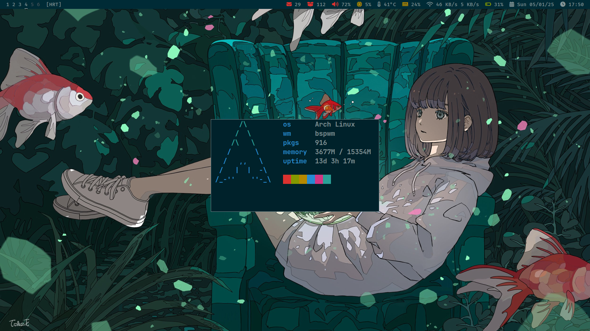
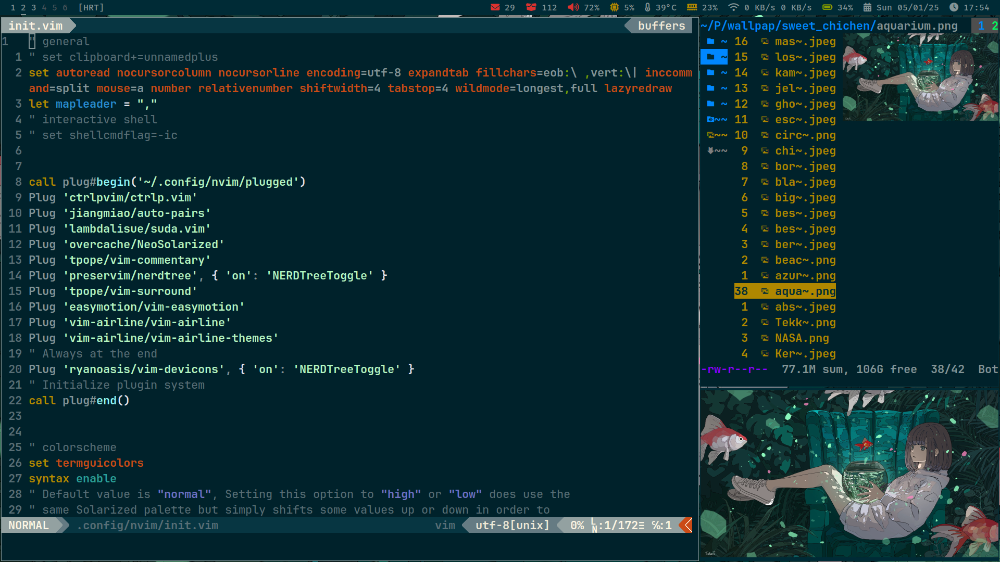
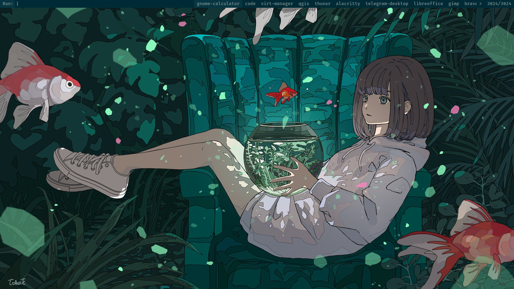
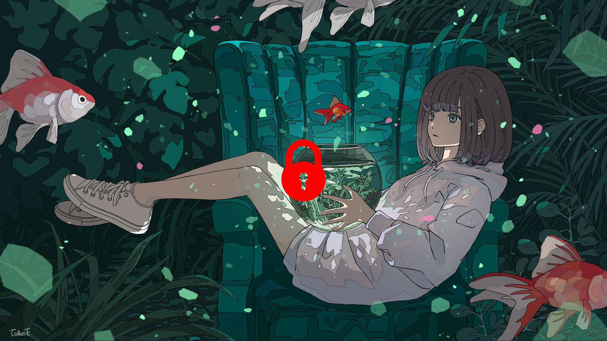

# dotfiles_bspwm

## Screenshots






## General
* This branch mainly focuses on performance. For transparency use [picom](https://github.com/ask1234560/dotfiles_bspwm/tree/master/dotfiles/config/picom) from master branch.

## Available dotfiles
```
dotfiles/
├── bashrc
├── config
│   ├── alacritty
│   ├── alias_and_keybinds
│   ├── browser_extensions_backup
│   ├── bspwm
│   ├── cpupower_gui
│   ├── dunst
│   ├── gdb
│   ├── git
│   ├── gtk-2.0
│   ├── gtk-3.0
│   ├── gtk-4.0
│   ├── htop
│   ├── Kvantum
│   ├── mimeapps.list
│   ├── mpv
│   ├── mutt
│   ├── newsboat
│   ├── paru
│   ├── picom
│   ├── polybar
│   ├── qt5ct
│   ├── ranger
│   ├── scripts
│   ├── slock
│   ├── starship.toml
│   ├── sxhkd
│   ├── sxiv
│   ├── X11
│   ├── yay
│   └── zathura
├── Desktop
│   └── xtra
├── local
│   └── share
└── zshrc
```

## Requirements
* [dotdrop](https://aur.archlinux.org/packages/dotdrop-git)
* place [wallpapers](https://github.com/ask1234560/wallpapers) in ```~/Pictures``` for selecting wallpapers using sxiv and during startup

## Installation
```
* git clone --single-branch --branch performance https://github.com/ask1234560/dotfiles_bspwm ~/.config/dotfiles_bspwm
* cd ~/.config/dotfiles_bspwm
* config.yaml is for user specific configs and global-config.yaml for system wide configs. Edit the yaml files with the hostname and the required configs
* dotdrop install
* Other installation
    * nvim
        * git clone --single-branch --branch performance https://github.com/ask1234560/neovim-config.git ~/.config/nvim
    * dmenu
        * git clone https://github.com/ask1234560/dmenu.git ~/.config/dmenu
        * build dmenu
           * cd ~/.config/dmenu
           * sudo make install
    * slock
       * cd ~/.config/slock
       * sudo make install
* set qt theme to Adapta Nokto(kvantum, qt5ct).
* for changing theme, change in alacritty, nvim, ~/.Xresources, dmenu, dunst, polybar(reads Xresources), cursor, mpv. Scrot custom region screenclip and bspwm focused window border have same width and color.
* Terminal font nerd-fonts-jetbrains-mono, ttf-fira-code for remaining apps and otf-font-awesome for polybar glyphs.
```

## Explicitly installed packages
```
7zip abook adapta-gtk-theme alacritty alsa-firmware alsa-utils amd-ucode aspell aspell-en autopep8 base base-devel bc brave-bin bspwm-git cpupower-gui-git cronie dmidecode dnsmasq dosfstools dotdrop-git dunst efibootmgr entr exiv2 eza ffmpegthumbnailer gimp git git-lfs gnome-calculator-gtk3 gnome-keyring gnu-free-fonts grub gtk-engine-murrine hsetroot htop-vim-git imagemagick inetutils iptables-nft jdk-openjdk kvantum less libomxil-bellagio libreoffice-fresh libxft libxinerama linux-firmware linux-zen linux-zen-headers lsof ltrace lua53 lynx man-db megasync-bin mpv mutt-wizard-git neovim networkmanager newsboat noto-fonts npm ntfs-3g numlockx nvidia-open-dkms nvidia-utils openresolv otf-font-awesome pacman-contrib pandoc-bin papirus-icon-theme paru-bin paru-bin-debug perl-image-exiftool pfetch-git polybar-git pulseaudio pulseaudio-alsa python-click-option-group python-docopt python-gdal python-lxml python-numpy python-owslib python-pip python-psycopg2 python-pynvim python-yaml qemu-desktop qgis qt5ct ranger-git redshift-minimal rmtrash rustup scrot simple-mtpfs sshpass starship strace subliminal-git sudo sxhkd-git sxiv telegram-desktop texlive-fontsrecommended texlive-latex texlive-latexrecommended thunar timeshift tk torbrowser-launcher transmission-cli trash-cli ttf-dejavu ttf-fira-code ttf-jetbrains-mono-nerd ttf-roboto ueberzugpp unclutter unrar unzip virt-manager visual-studio-code-bin weechat wget xclip xdg-user-dirs xdotool xorg-server xorg-xdpyinfo xorg-xev xorg-xinit xorg-xrandr xorg-xsetroot yt-dlp-git z-git zathura zathura-pdf-poppler zip zsh zsh-autosuggestions-git zsh-syntax-highlighting-git
```
