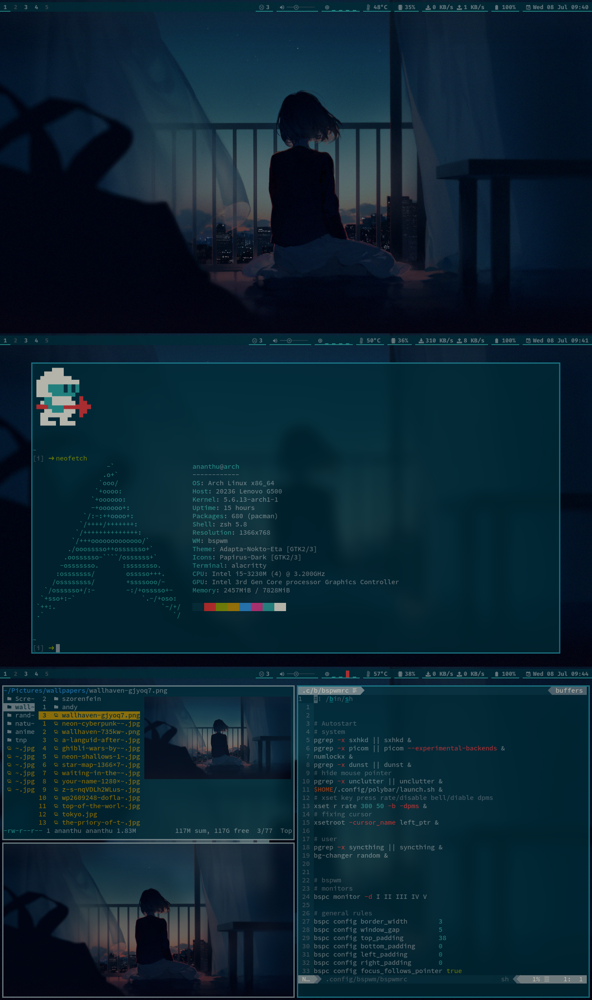

# dotfiles_bspwm
```
dotfiles
├── bashrc
├── config
│  ├── .aliasrc
│  ├── alacritty
│  ├── bspwm
│  ├── dmenu
│  ├── dunst
│  ├── gtk-3.0
│  ├── htop
│  ├── mpv
│  ├── newsboat
│  ├── nvim
│  ├── picom
│  ├── polybar
│  ├── ranger
│  ├── scripts
│  ├── sxhkd
│  ├── sxiv
│  └── zathura
├── gitconfig
├── gtkrc-2.0
├── icons
│  └── Breeze-Blue
├── local
│  └── share
├── xinitrc
├── Xmodmap
├── xprofile
├── Xresources
└── zshrc
```

## Screenshots



## Requirements
* working arch linux with bspwm
* ```pacman -S python python-pip zsh```
* [yay](https://github.com/Jguer/yay)
* change shell to zsh
  * ```chsh -s $(which zsh)```
* ```sudo pip3 install pipenv subliminal ueberzug``` virtual environment/downloading subtitles using mpv/image preview ranger.
* place [wallpapers](https://github.com/ask1234560/wallpapers) in ~/Pictures for selecting wallpapers using sxiv and during startup

## Installation 
```
* cd ~/.config
* git clone https://github.com/ask1234560/dotfiles_bspwm
* cd dotfiles_bspwm
* git submodule init 
* git submodule update --recursive 
* update submodules(dotdrop, dmenu, nvim)
   * git submodule foreach git pull origin master
* pipenv sync
* pipenv shell
* config.yaml is for user specific configs and global-config.yaml for system wide configs. Edit the yaml files, add the hostname and required configs in it
* ./dotdrop.sh install
* install zplug
  * curl -sL --proto-redir -all,https https://raw.githubusercontent.com/zplug/installer/master/installer.zsh | zsh
* build dmenu
   * cd ~/.config/dmenu
   * sudo make install
* set qt theme to Adapta Nokto(kvantum, qt5ct).
* (optional) to remove backup files
   * find ~ -regextype grep -regex '.*/*dotdropbak' -exec rm {} \;
* for changing theme, change in alacritty, nvim, nvim quick scope pluggin(init.vim), ~/.Xresources, dmenu, dunst, polybar(reads Xresources), cursor.
* Terminal font SauceCodePro Nerd Font Mono, other applications font FiraCode Nerd Font.
```
   
## (Optional) Explicitly installed packages  
```
yay -S --needed adapta-gtk-theme alacritty alsa-firmware alsa-utils autoconf automake base bc betterlockscreen binutils bison brave-bin broadcom-wl-dkms bspwm cronie dosfstools dunst efibootmgr exa exiv2 fakeroot ffmpegthumbnailer file findutils flex gawk gcc gettext gimp git grep groff grub gtk-engine-murrine gzip hsetroot htop imagemagick kvantum-qt5 libreoffice-fresh libtool linux linux-firmware linux-headers lynx m4 make man-db megasync mlocate mpv neofetch neovim nerd-fonts-fira-code nerd-fonts-source-code-pro networkmanager newsboat noto-fonts npm ntfs-3g nudoku-git numlockx openresolv openvpn pacman pacman-contrib papirus-icon-theme patch picom-tryone-git pkgconf polybar pulseaudio pulseaudio-alsa python-pip qt5ct ranger redshift-minimal rmtrash scrot sed shell-color-scripts simple-mtpfs simplenote-electron-bin sudo sxhkd sxiv syncthing texinfo thunar timeshift trash-cli ttf-ms-fonts ttf-roboto ttf-symbola ttf-vista-fonts unclutter unrar vi virtualbox virtualbox-ext-oracle virtualbox-guest-iso wget which wireguard-tools xclip xdg-user-dirs xdman xorg-server xorg-xinit xorg-xsetroot yay-bin youtube-dl zathura zathura-pdf-poppler zsh
```
